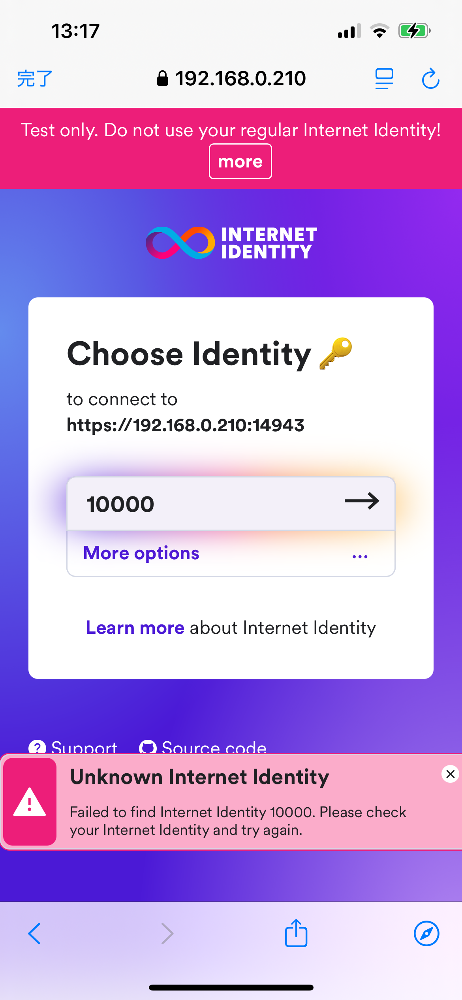
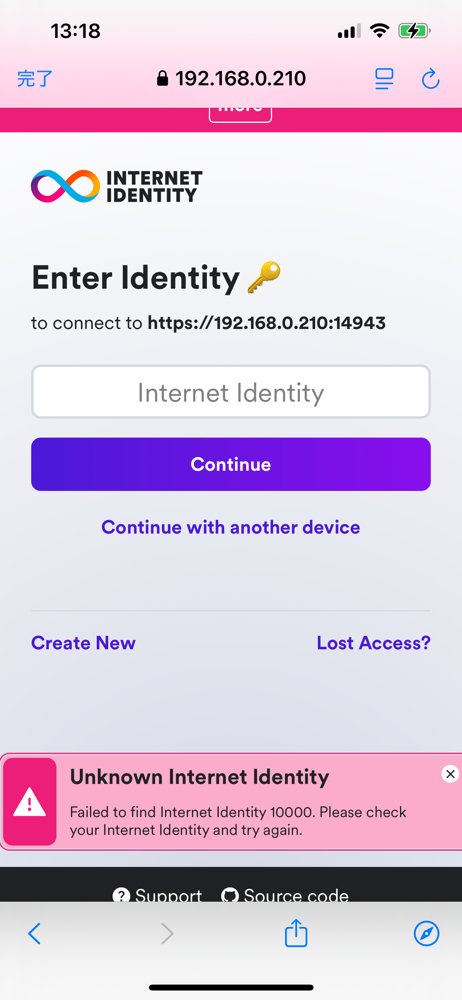

# Setup Instructions

## Required Environment

- Node.js version 18 or higher is required

## Installing Expo Go

Install the "Expo Go" app on your device:

- For iPhone/iPad users: Install from App Store
- For Android users: Install from Google Play Store

## mkcert Installation

mkcert is a tool for easily implementing HTTPS communication in local development environments.
Here's how to install and configure mkcert.

### macOS Installation

```bash
brew install mkcert
brew install nss # Required if using Firefox
```

### Root CA Setup

```bash
mkcert -install
```

### Check Root Certificate Location

```bash
mkcert -CAROOT
```

### Installing Root Certificate on iOS

- Send rootCA.pem file to iOS device
- Install from "Profile Downloaded" in Settings app
- Enable mkcert certificate in Settings → General → About → Certificate Trust Settings

### Installing Root Certificate on Android

- Transfer rootCA.pem file to Android device
- Go to Settings → Security → More → Install from storage
- Select and install as CA certificate

**Important Notes**

- nss installation is mandatory when using Firefox
- Never share generated key files
- Root certificate installation process may vary depending on Android device model

## Downloading this project

Download the project and move to the project folder with the following commands:

```bash
git clone https://github.com/higayasuo/<REPOSITORY_NAME>
cd <RESPOSITORY_NAME>
```

Replace `<REPOSITORY_NAME>` with this project's repository name.

## Setting Up Rust and ICP Development Tools

### Command Execution

Execute the following commands to set up Rust and ICP development tools:

```bash
sh ./scripts/setup.sh
```

### Verifying Setup

Run these commands to verify that the setup completed successfully:

```bash
rustc -V
dfx -V
```

If both commands display version information, the setup was successful.

**Notes**:

- When checking versions, make sure to use capital "V"
- Setup may take several minutes to complete
- After setup, run `exec $SHELL -l` to update shell paths

## Setting Up Subprojects

This project consists of several subprojects.
Execute the following command to set up the subprojects:

```bash
npm run setup
```

## Setting Up Static IP Address

To access the development server on your PC from a smartphone, you need to set up a static IP address.
This ensures the IP address remains unchanged even after PC restart, enabling stable connectivity.

### macOS

1. Open "System Settings" from the Apple menu

2. Click "Network" in the sidebar

3. Select your active network connection (Wi-Fi or Ethernet) and click "Details"

4. Open the "TCP/IP" tab

5. From the "Configure IPv4" dropdown menu, select "Using DHCP with manual address" and enter the following:
   - IP Address
     - Recommended to use range 192.168.0.200-192.168.0.254 to avoid conflicts with DHCP dynamic assignments.
       For example, you could use 192.168.0.210.
   - If you use an address other than 192.168.0.210, please update the IP address in the file below.
     - [../src/frontend/app/+html.tsx](../src/frontend/app/+html.tsx)
     - [../src/frontend/public/.ic-assets.json5](../src/frontend/public/.ic-assets.json5)
     - [../src/ii-integration/public/.ic-assets.json5](../src/ii-integration/public/.ic-assets.json5)

## Creating Server Certificate

To enable HTTPS communication with the previously set static IP address, we'll create a server certificate.

### Preparation

```bash
mkdir .mkcert
cd .mkcert
```

Create and move to a dedicated folder for certificate storage.

### Certificate Creation

```bash
mkcert [static IP address]
```

The following files will be generated:

- [static IP address].pem - Server certificate
- [static IP address]-key.pem - Private key

### Completion

```bash
cd ..
```

Return to the original folder.

**Important Notes**

- Certificate validity period is 27 months
- Never share the private key
- Store certificates in a secure location

## local-ssl-proxy Configuration

Update the ssl:canisters, ssl:ii entries in package.json with your configured static IP address.

### Updating package.json

```json
{
  "scripts": {
    "ssl:canisters": "local-ssl-proxy --key ./.mkcert/[static IP address]-key.pem --cert ./.mkcert/[static IP address].pem --source 14943 --target 4943",
    "ssl:ii": "local-ssl-proxy --key ./.mkcert/[static IP address]-key.pem --cert ./.mkcert/[static IP address].pem --source 24943 --target 4943"
  }
}
```

Each configuration does the following:

- `--key`: Specifies the path to the private key file
- `--cert`: Specifies the path to the server certificate file
- `--source`: Port number used for HTTPS access
- `--target`: Port number where the actual development server is running

**Important Notes**

- Replace [static IP address] with the static IP address you configured earlier
- Ensure the server certificate and private key file paths match the location of files generated by mkcert

## Starting Local Replica

A local replica is a local execution environment for running Canisters.
Open a new terminal and execute the following command:

```bash
npm run dfx:start
```

The local replica will start on port 4943.

### How to Stop Local Replica

To stop the local replica, use either of these methods:

- Press Ctrl+C in the running terminal
- Execute `dfx stop` command in another terminal

**Important Note**
If you see the error `Error: dfx is already running.`, it likely means dfx start is already running. Stop the local replica with dfx stop first, then restart the development server.

## Deploying Canisters for local

To deploy Canisters to the local replica, execute the following command:

```bash
npm run dfx:deploy
```

This command performs the following:

1. Builds all Canisters (internet-identity, ii-integration, frontend, backend)
2. Installs the built Canisters to the local replica

**Important Notes**

- dfx:start must be running before deployment
- Deployment may take several minutes to complete

## Starting local-ssl-proxy

Here's how to start local-ssl-proxy

### Launch Commands

```bash
npm run ssl:canisters
npm run ssl:ii
```

These commands do the following:

1. ssl:canisters provides HTTPS connection for Canisters (14943→4943)
2. ssl:ii provides HTTPS connection for Internet Identity (24943→4943)

**Important Notes**

- Run each command in a separate new terminal
- Before running commands, ensure target ports are not in use
- Verify SSL certificate paths are correctly configured
- After launch, each can be stopped individually with Ctrl+C

## Starting Expo Development Server

### Launch Command

```bash
npm run frontend:start
```

This command performs the following:

1. Starts the Expo developer server
2. Displays a QR code
3. Shows an operation menu

### Troubleshooting

#### Outdated Expo Dependencies

If you see a warning about outdated Expo packages, it means some of your Expo-related dependencies are not at their recommended versions. This can cause compatibility issues.

You might encounter an error message like this:

```
The following packages should be updated for best compatibility with the installed expo version:
  expo@53.0.7 - expected version: 53.0.9
  expo-constants@17.1.5 - expected version: ~17.1.6
  expo-image@2.1.6 - expected version: ~2.1.7
  expo-linking@7.1.4 - expected version: ~7.1.5
  expo-router@5.0.5 - expected version: ~5.0.7
Your project may not work correctly until you install the expected versions of the packages.
Found outdated dependencies
```

To resolve this, run the following command in `src/frontend` directory:

```bash
cd src/frontend
npx expo install --fix
```

This command will automatically update all Expo-related packages to their compatible versions.

### Main Operations

- Press `w` key: Launch app in web browser

### Running on Smartphone

1. Install Expo Go app
2. For iOS: Scan QR code with Camera app
3. For Android: Scan QR code with Expo Go app

**Important Notes**

- PC and smartphone must be connected to the same Wi-Fi
- Stop Expo development server with Ctrl+C

**Android Limitations**

- Local Internet Identity does not work on Android
- Mainnet Internet Identity works
- Please perform Expo Go testing on iOS

## Troubleshooting for Internet Identity

### Unknown Internet Identity Error

#### Issue Description
When selecting an Identity on the Choose Identity page, you may encounter an "Unknown Internet Identity" error. This typically happens when:
- The local Internet Identity canister has been redeployed
- You previously created an Identity that is no longer recognized

The error occurs because while your browser remembers the Identity, the local Internet Identity canister has lost this information during redeployment.



#### Solution
To resolve this issue:

1. On the Choose Identity page, locate the problematic Identity
2. Tap "More options" displayed under the Identity
3. Tap the "Create New" button in the bottom left
4. You can recreate Identity 10000



#### Prevention
To avoid this issue in the future:
- Avoid redeploying the Internet Identity canister after creating Identities
- If you need to redeploy, be prepared to recreate your Identities
